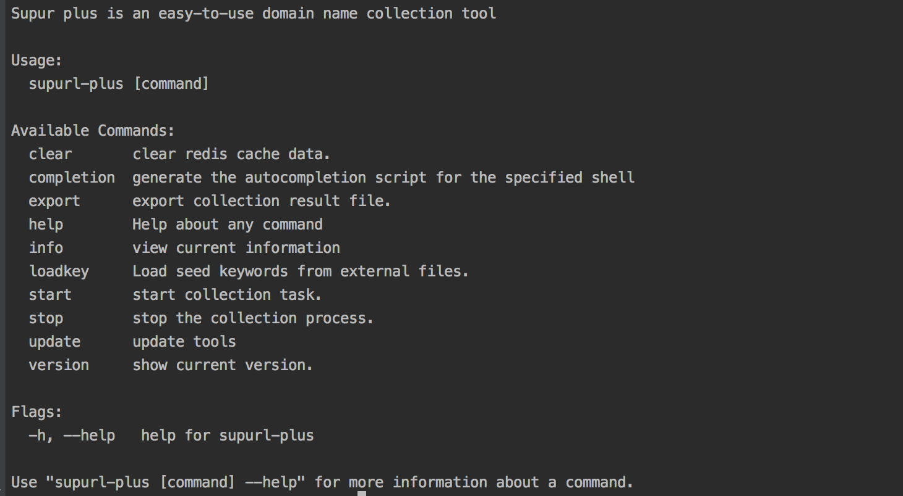

### 软件简介
```
新一代的关键词域名采集系统(supurl-plus)，采用Go语言开发，每日采集不重复域名/网址超千万级！

可自定义开启与关闭国内采集、国外采集引擎。

可突破反爬虫机制，支持国内与国外多个主流的搜索引擎，支持自动拓展关键词，支持外链采集，支持批量采集等。

可根据用户提供的种子关键词txt文件，自动的从多个自定义的搜索引擎采集全网不重复域名/网址数据。

本软件提供持续的更新与维护服务。
```

### 目前支持的搜索引擎
```
百度: 国内知名引擎，主要应用于中文采集；
必应: 国际知名引擎，同时具有中文、外语模式；
谷歌: 国际知名引擎，同时支持国内外网站采集；
搜狗: 国内知名引擎，同时具有中文、外语模式；
Yandex: 国际知名引擎，主要应用于国外网站采集；
Aol: 国际知名引擎，主要应用于国外网站采集；
...
```

#### 运行环境

同时支持windows,linux,mac等操作系统！
```
需要安装以下软件：
- redis          用于存储采集结果
- chrome         浏览器【如果搜索引擎使用的有browser模式，则必须安装】
```


### 软件截图




### 软件优势
- 采集效率高！普通服务器每天也可轻松采集千万不重复域名；
- 更新速度快，专业团队持续维护！
- 提供完善的软件使用在线文档，方便使用；
- 简单便捷，无需技术经验也可以快速上手使用(订购后免费远程安装与调试一次)；
- 同时支持家用电脑和服务器，并且服务器配置没有要求；
- 跨平台，可完美运行在ubuntu、centos、windows、mac等系统；
- 可无人值守, 除非人工停止或服务器异常，否则会持续自动拓展关键词，持续采集；
- 全新的构架设计，内置多种模式，比如HTTP模拟加强、selenium等。可突破搜索引擎的反爬虫机制！
- 企业级标准开发,采用go语言开发，稳定性与效率高，双层缓存算法！
- 稳定的支持千万级数据，内存操作算法高效的全自动过滤重复域名数据；
- 支持后台运行，支持实时停止采集；
- 支持实时查看采集结果统计信息，无需运行其他软件；
- 支持自定义导出功能，一条命令可导出全部不重复数据。可自定义文件名，以及指定导出某一天的数据；
- 支持采集结果自动按天存储，并且每天的数据都是不重复的
- 支持自动清除redis中的历史数据，支持自定义删除；
- 支持外链采集；
- 支持自动分词形式的自动拓展种子关键词；
- 支持搜索引擎相关词形式的自动拓展种子关键词；
- 支持只采集顶级域名；
- 支持自定义过滤域名，比如过滤gov.cn；
- 支持关键词拓展过滤，比如包含有"视频"的关键词自动忽略；
- 支持根据服务器配置，自定义外链采集线程数、搜索引擎线程数、拓展关键词引擎线程数等