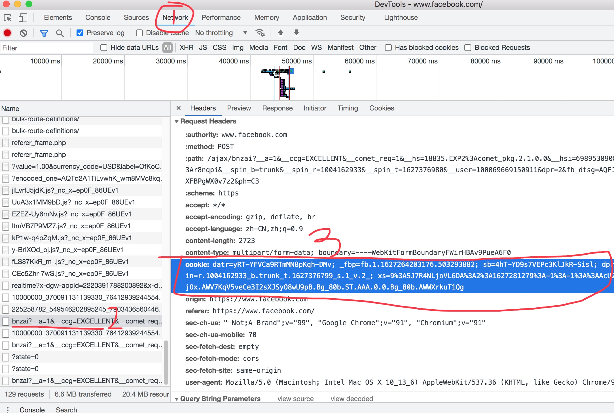

## facebook获取cookie的教程

facebok的cookie，是谷歌引擎采集(facebook模式)的必填参数；

#### 访问fackbook官网并登录

使用chrome访问以下网址：

https://www.facebook.com/

#### 使用chrome获取cookie

登录后，在网页中鼠标右键选择"检查"，即可打开chrome调试工具；
1. 切换到"network"选项界面；
2. 刷新facekook页面，即可在"network"界面中显示所有网络请求；
3. 在界面的左侧，随便点击一个请求，在右侧即可显示请求的信息，如：



4. 复制上图中"cookie:"后面的内容，填写到config/config.ini配置文件中。(google.cookie),如：

```
[google]
region =
homepage =
cookie = datr=yRT-YFVCa9RTmMN8pKqh-DMv; _fbp=fb.2.2627264203176.503293882; sb=4hT-YD9s7VEPc3KlJkR-Aisl; dpr=2; locale=zh_HK; c_user=100069669150911; spin=r.1004155990_b.trunk_t.1627281283_s.1_v.2_; wd=1334x707; xs=9%3ASJ7R4NLjoVL6DA%3A2%3A1627281279%3A-1%3A-1%3A%3AAcUk65hdJBHtgNql8YSyaSvTCbMV6CCYHi90bXms8g; fr=1y29c15EFiPfn8jpF.AWUhDAfY0qIBX-CZVu9j_-E5NU0.Bg_5rE.ST.AAA.0.0.BAg_5rE.AWUDjn5RHho1AA

```