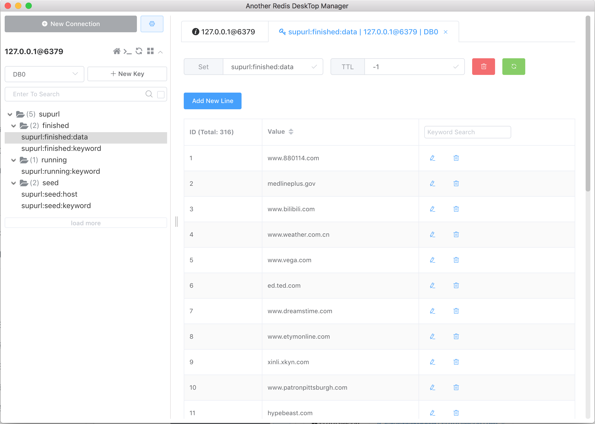
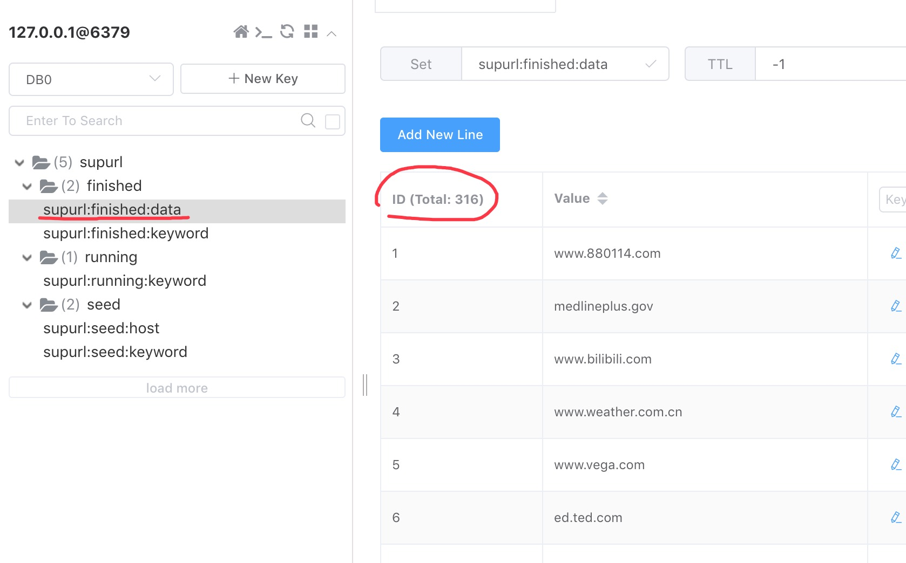
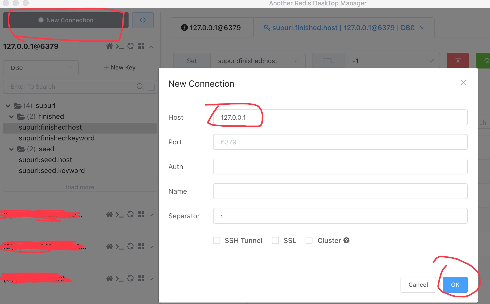

## windows安装教程

### 1：redis相关环境安装

##### 1）服务端安装与运行

```
redis绿色服务端 下载地址：
http://cms.2te.cc/resource/redis_server.zip
```
下载后，解压，找到redis-server文件，双击运行即可。打开后，在终端中多敲几下回车键即可完成启动；

备注：如果是服务器，为了安全，也可以自行修改redis的配置文件，加上密码以及只允许本地访问。


##### 2）客户端安装(可选)

redis客户端也可以不安装。安装了之后查看实时采集情况就方便一些。不过也可以使用软件自带的info命令，也可以查看实时采集的结果数！
linux下supurl-plus info命令运行如：
```
superldeMacBook-Pro:supurl-plus superl$ ./supurl-plus info
当前已采集不重复域名数量:316
当前采集中关键词数量:84
当前已采集完成的关键词数量:10
当前剩余待采集关键词数量:238
```

```
redis强加版客户端 下载地址：
http://cms.2te.cc/resource/redis_client.zip
```
下载上面的redis_client.zip文件，解压，然后一步一步安装即可。安装完成后，会在桌面创建快捷打开的图标。
运行后，点击"New Connection"即可添加redis链接；

注意，采用本文档提供的redis服务端的话，默认是没有redis链接密码的。所以，只需要在New Connection的界面中，输入HOST： 127.0.0.1 即可链接。

软件界面如图：



查看采集结果如图：



新增redis服务端连接说明：




### 2：编辑器软件下载

配置文件和关键词文件，如需修改，都建议使用编辑器软件打开进行修改！如果使用windows自带的"记事本"打开，则可能导致编码问题导致采集异常！
软件需要的编码为：utf-8

推荐的编辑器如：
```
notepad++
本地下载：http://cms.2te.cc/resource/notepad_install.zip
官网地址: https://notepad-plus-plus.org/downloads/

sublime text:
下载地址：
官网地址: http://www.sublimetext.com/3

```

### 3: chrome浏览器下载与安装

<font color="Hotpink">
注意：如果开启的搜索引擎中，使用的模式包含browser模式采集，则必须先安装chrome浏览器，如果只是HTTP模式，则无需安装!
</font>

```
下载chrome浏览器没有什么好说的，百度搜索了直接下载即可；
```

### 4：采集软件安装

采集软件其实无需安装，也属于绿色软件，只需要下载后解压即可使用；

```
下载地址(最新版联系客服获取，其中的xxx是最新版本号)：
http://url.2te.cc/supurl-plus/release/windows/xxxxx.zip
```