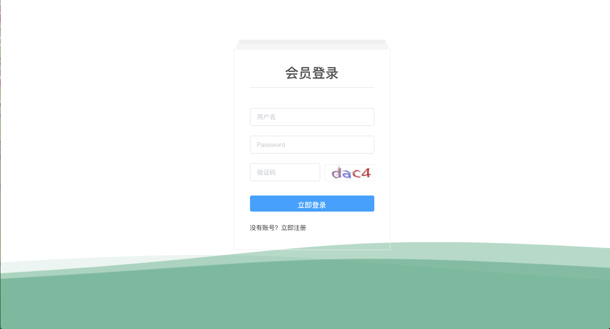
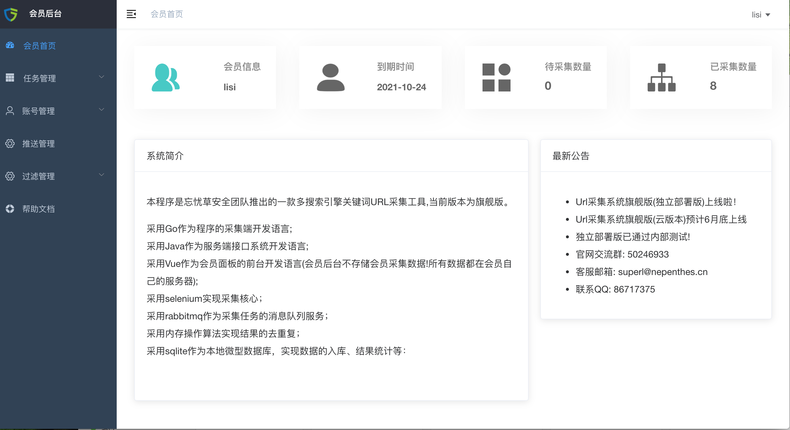
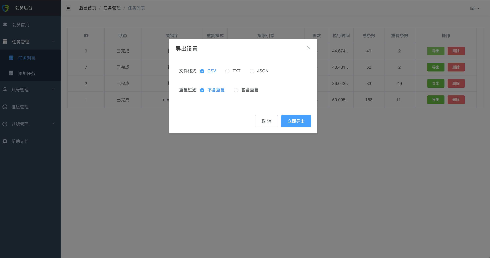
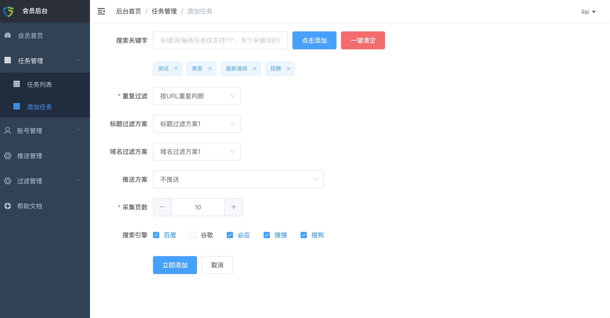
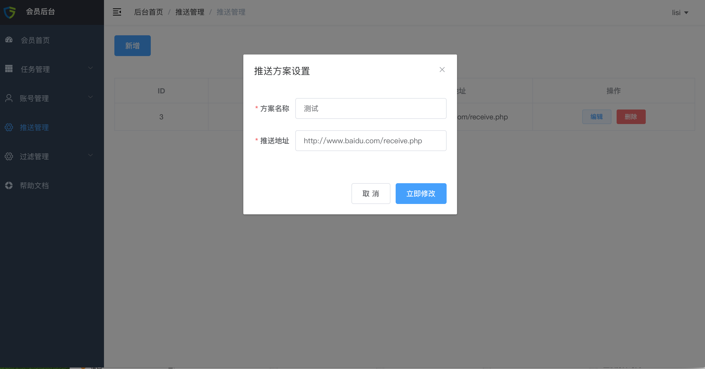
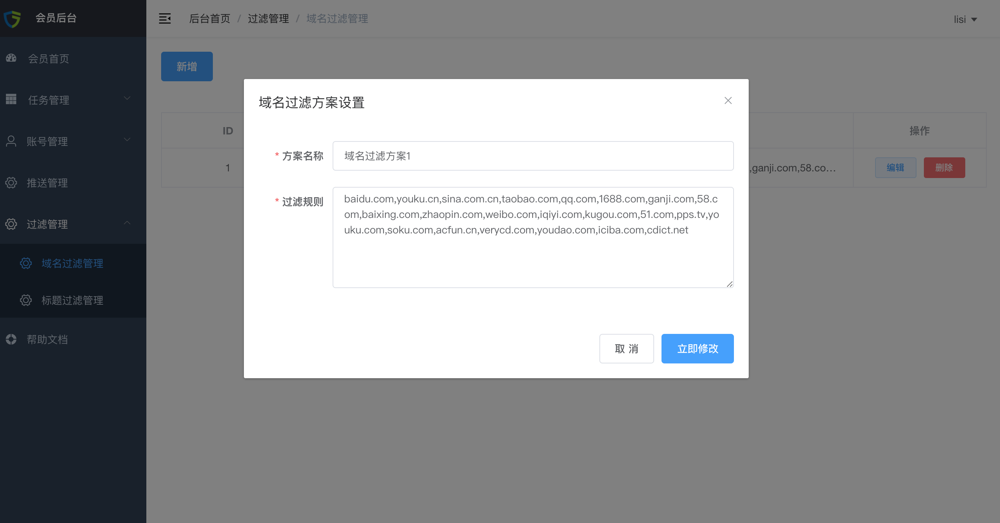
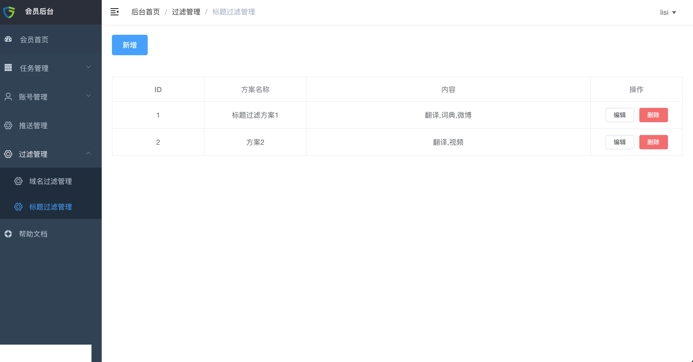
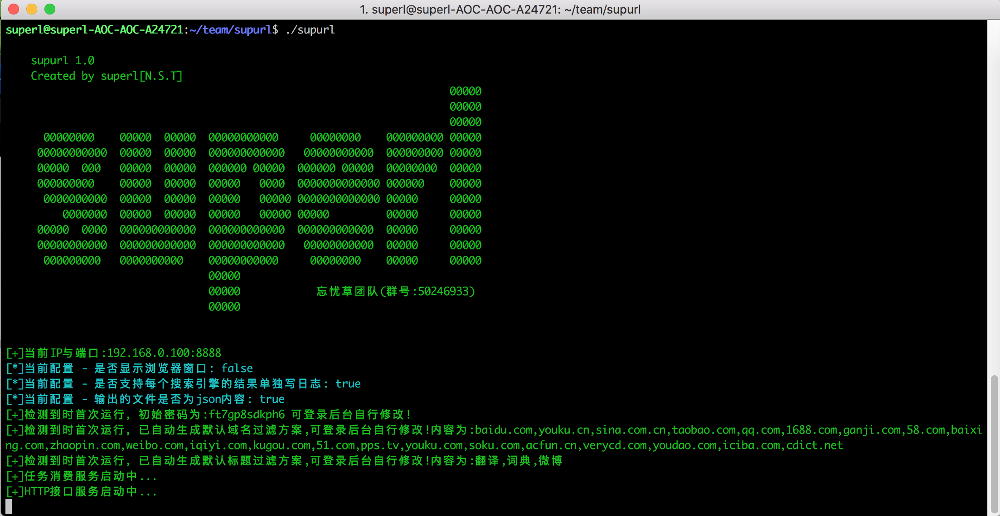
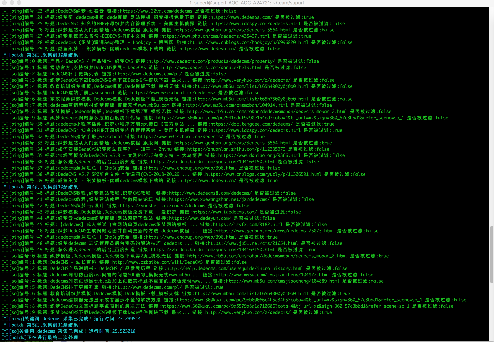
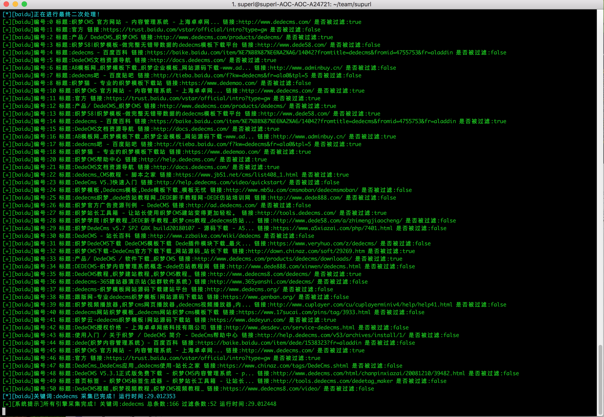

## 新一代关键词URL采集系统(Supurl)

### 最新公告
- supurl v1.0 已上线！于2020年中旬开始研发，在2021年6月12日上线。

### 系统简介

Supurl，是新一代的关键词URL采集系统。可完美突破所有搜索引擎的反爬虫机制！

可根据用户录入的关键词，自动化的使用全网主流的多个搜索引擎(包括但不限于百度、谷歌、必应、搜狗、搜搜等)，获取搜索引擎的返回结果进行统一采集与处理的一款程序。采集与处理的信息包括但不限于真实URL地址、排名、标题等。

程序主要运用于网络安全相关项目，比如批量评估各类CMS系统0DAY的影响程度。以及可作为舆情监控系统的搜索引擎监控组件。

### 关于商业版

本系统分为多个版本，包括会员版、旗舰版。目前暂未发布免费版。

鉴于superl-url项目的使用者较多，总是有小伙伴联系我需要定制二次开发，但工作繁忙一直没时间接。为了减少二次开发成本，所以融合多个客户的所有需求，统一研发出商业版本supurl；

如需使用，可联系QQ：86717375

#### 关于旗舰版

旗舰版是目前已经研发完成的产品，支持客户在自己的服务器独立部署！所有数据都是存储在客户自己的服务器上，仅供客户自己使用。会员面板仅仅是做API数据转发。

#### 关于会员版

会员版目前还在开发中...  是基于云的形式进行构架，会员只需要开通账号即可。所有采集任务都是由官方服务器节点完成。由于采集比较消耗资源，任务如果多的情况下可能需要排队。

### 系统优势

- 全新的构架设计，可完美突破所有搜索引擎的反爬虫机制！
- 完美兼容支持所有搜索引擎，可多个搜索引擎并发采集；
- 采用GO语言实现采集核心，并且稳定性与效率高；交叉编译跨平台，可完美运行在ubuntu、centos、windows、mac等系统；
- 拥有WEB版本会员网站后台，在后台即可实现采集任务的管理与方案自定义。无需技术经验，小白也能快速上手！
- 灵活的过滤方案自定义、重复判断模式自定义；
- 灵活的导出功能，同时支持导出excel表格csv、json、txt等文件；
- 强大的HTTP API推送接口功能，可实现采集结果的推送。可进行二次开发拓展，对接到自己的接口，灵活存储与自定义结果。

### 会员后台截图

### 采集客户端运行截图

### 演示视频

暂无

### 功能一览

### 技术实现

- 采用Go语言作为采集客户端的开发语言，交叉编译跨平台；
- 采用selenium实现采集基础核心；
- 采用rabbitmq消息队列；
- 采用内存操作算法实现结果的去重复；
- 采用sqlite作为本地微型数据库，实现数据的入库、结果统计等；
- 采用java作为会员端API接口的转发服务；
- 采用vue + elementui用于会员网站系统的前端开发；

### 联系方式

联系QQ： 86717375
忘忧草安全交流2群：50246933

