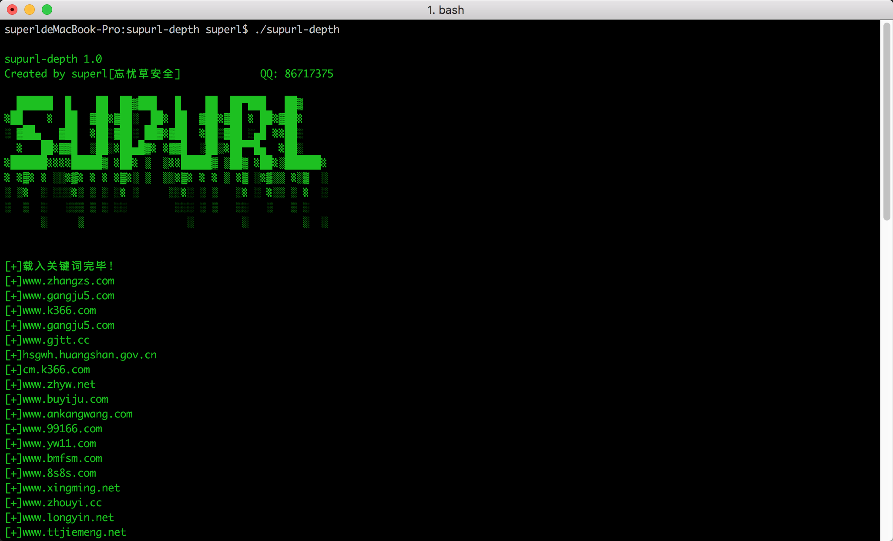
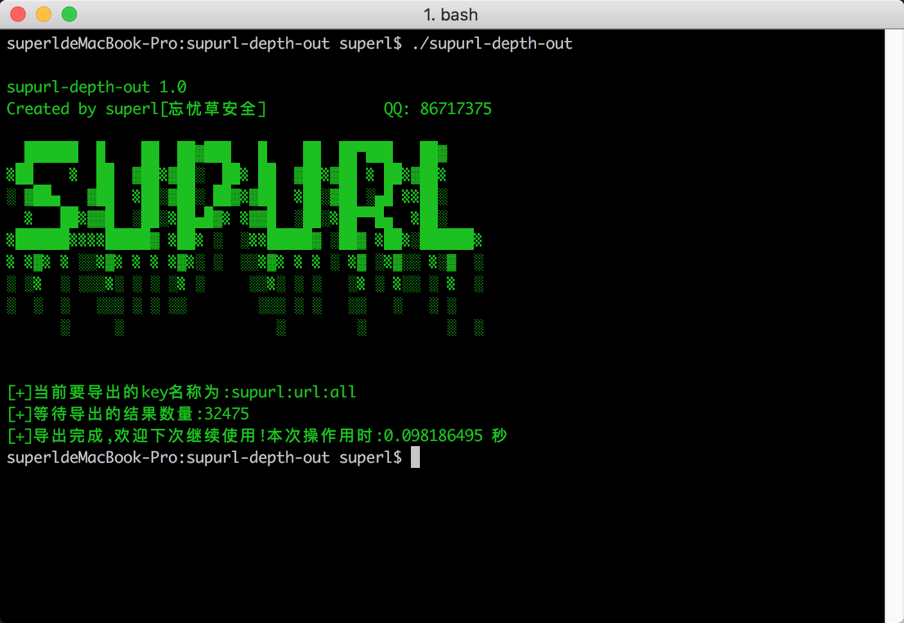

### 系统简介(supurl-depth)

此版本，用于批量指定关键词的大规模深度采集！

系统运行后，会自动根据种子关键词，每次采集全自动的通过搜索引擎获取每个关键词的相关词。

经过实际测试，每小时可轻松采集百万条不重复域名，每天可轻松采集千万条域名！支持百度 + 必应搜索引擎；
只采集域名，自动重复过滤。

附带go语言开发的配套数据导出工具！


### 系统优势

- 采用GO语言开发，运行环境简单，无需安装依赖！
- 自动过滤重复数据；
- 可多个搜索引擎并发采集，可灵活自定义线程数；
- 全新的构架设计，稳定性高，并且系统资源占用少；
- 跨平台，可完美运行在ubuntu、centos、windows、mac等系统；
- 采集速度与采集效率高，每天可采集千万级别域名。
- 导出效率高！

### 使用说明

##### 运行说明
```
1：需要先安装redis;
2：需要安装chrome谷歌浏览器。下载地址：https://www.google.cn/chrome/
3：需要下载当前系统上chrome浏览器对应的驱动程序并运行。下载地址：http://npm.taobao.org/mirrors/chromedriver/；

备注：
目前最新的chrome浏览器为91.0.4472.19版本。可访问以下地址下载：http://npm.taobao.org/mirrors/chromedriver/91.0.4472.19/

以上3步都完成后，即可在当前目录位置打开命令行窗口，运行supurl-depth.exe
```

谷歌浏览器下载地址：
https://github.com/super-l/supurl/blob/main/resource/windows/91.0.4472.114_chrome_installer.exe

谷歌浏览器驱动下载地址：
https://github.com/super-l/supurl/blob/main/resource/windows/chromedriver_win32.zip

redis服务端下载地址：
https://github.com/super-l/supurl/blob/main/resource/windows/Redis-x64-3.0.504.zip

redis客户端下载地址：
https://github.com/super-l/supurl/blob/main/resource/windows/redis-desktop-manager-0.8.8.384.exe

supurl-depth导出程序下载地址：
https://github.com/super-l/supurl/blob/main/resource/windows/supurl-out.exe

##### 导出说明
```
1：打开命令提示符(终端)，使用cd /d 命令跳转到当前程序目录；
2：运行 supurl-out.exe

运行后，会输出导出的结果数量，把结果保存到配置文件中[out]节点下的filename项的指定的文件，同时也会显示消耗的时间信息。

```

##### 其他说明
```
如果手工结束运行，建议检查残余的chrome驱动进程。手工结束。

如果是Linux系统或MAC系统，可使用如下命令一键清除：

ps -ef | grep 'Google Chrome' | awk '{print $2}'|xargs kill -9
```

### 运行截图(supurl-depth)



### 导出截图(supurl-depth)



### 联系方式

- 联系QQ： 86717375

- 忘忧草安全交流2群：50246933